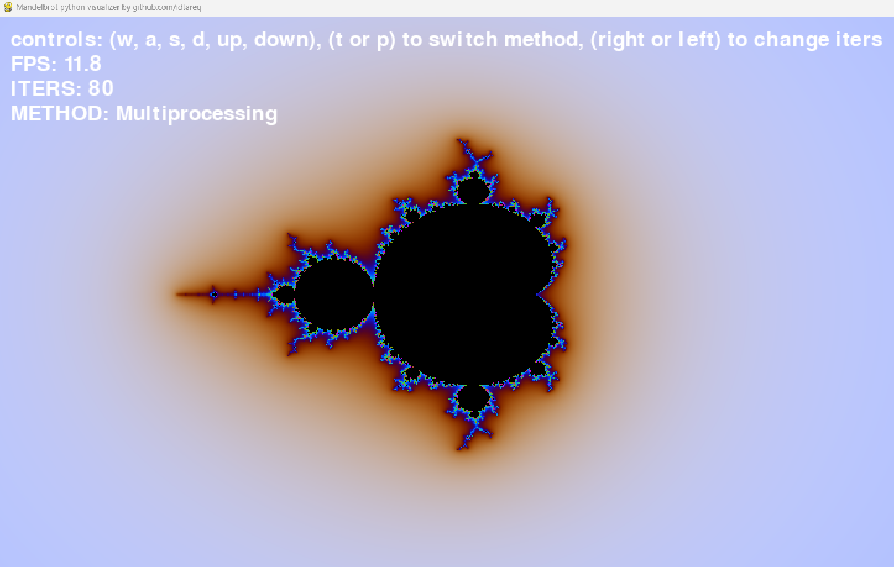

# Mandelbrot Visualizer: Multiprocessing vs. Multithreading

This application visualizes the Mandelbrot set while showcasing the performance differences between multiprocessing and multithreading in Python.

**Why Multiprocessing vs. Multithreading?**  
Python's Global Interpreter Lock (GIL) generally restricts efficient CPU utilization when using threads for CPU-bound tasks. Multiprocessing overcomes this by creating separate processes, which leads to better performance. This application allows you to switch between both modes and observe their performance.

## Installation

- `python -m venv .venv`
- `source .venv/bin/activate` on Linux or `.venv\Scripts\activate` on Windows
- `pip install requirements.txt`
- `python app.py`

## Usage and Controls

- Movement Controls:
(w, a, s, d): Navigate the scene horizontally and vertically.
- Zoom Controls:
up: Zoom in.
down: Zoom out.
- Iteration Adjustment:
right: Increase the number of iterations for better resolution.
left: Decrease the number of iterations.
- Worker Type Switch:
1: Switch to Multiprocessing mode.
2: Switch to Multithreading mode.

## Screenshot

