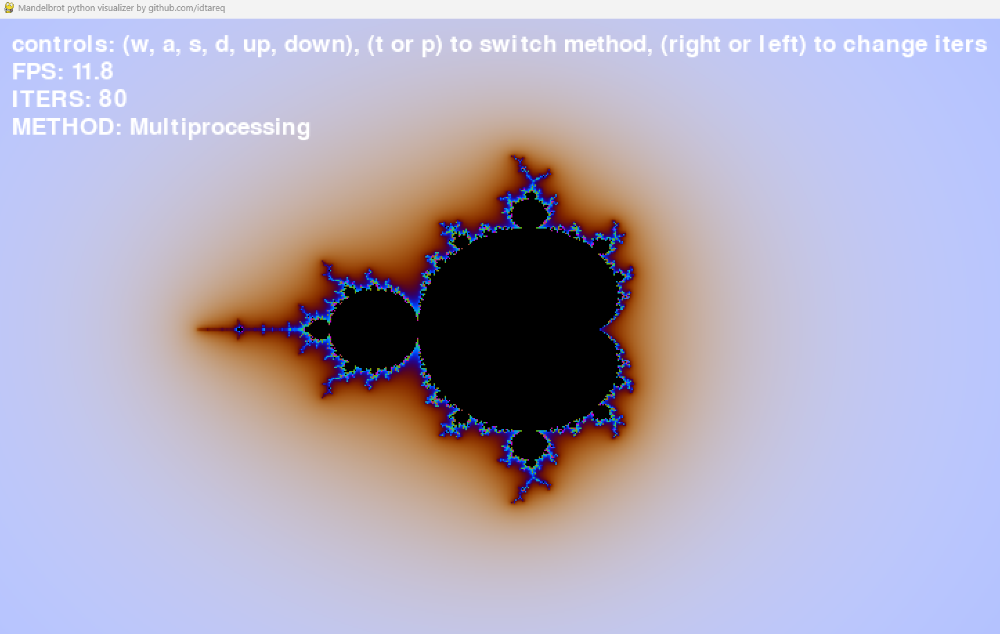

# Mandelbrot Set Visualizer in Python

This visualizer illustrates the performance differences between Multiprocessing and Multithreading in Python using the Mandelbrot set as an example.

Python's Global Interpreter Lock (GIL) typically results in Multithreading performing less efficiently than Multiprocessing, particularly for tasks that require heavy use of the CPU.

## Libraries

`pygame` for rendering graphics  
`cython` for speeding up numerical computations  
`numpy` for array manipulation and access

## Usage

`pip install requirements.txt`
`python main.py`

Note: you may need to compile `calculate_mandelbrot.pyx`, run `python setup.py build_ext --inplace`

## Controls

`(w, a, s, d)`: Move the scene  
`up`: Zoom in  
`down`: Zoom out  
`(right or left)`: Increase/decrease the number of iterations  
`1`: switch to Multiprocessing  
`2`: switch to Multithreading  

